# Horsari — Presentation Outline

Slide structure per class-wide feedback: Introduction → Context → Solution → System Architecture → Actors + Features → Main Flow (icon-driven, one beat per slide) → Conclusion & Limitation.

## Slide 1 — Introduction

- Project name: Horsari — horse racing tournament & prediction management platform
- Team, course, date
- One-line pitch: a web + mobile system that digitizes how horse racing tournaments are organized, judged, and followed

## Slide 2 — Context

> Đua ngựa là một hoạt động thể thao và giải trí có nhiều đối tượng tham gia như chủ ngựa, jockey, trọng tài, ban tổ chức và khán giả. Trong mỗi giải đấu cần quản lý các hoạt động như đăng ký thi đấu, sắp xếp cuộc đua, theo dõi kết quả, bảng xếp hạng và dự đoán kết quả.

> Việc quản lý giải đua ngựa hiện nay còn thủ công và thiếu đồng bộ, khiến quá trình quản lý thông tin, lịch thi đấu, kết quả và dự đoán mất nhiều thời gian, dễ xảy ra sai sót và gây khó khăn cho cả ban tổ chức lẫn người tham gia.

- Multiple stakeholder types (horse owner, jockey, referee, organizer/admin, spectator) each need different information at different times
- Current process is manual and disconnected → slow, error-prone, hard to coordinate

## Slide 3 — Solution

- Horsari: a unified platform (web for Admin/Referee/Horse Owner, mobile for Jockey/Spectator) covering the full tournament lifecycle
- Replaces manual coordination with structured workflows: invitations, approvals, live race tracking, automated payouts, predictions
- Real-time updates (WebSocket) keep every role in sync without manual refreshing

## Slide 4 — System Architecture

**Client layer**
- Web app — React 19 + Vite, Tailwind CSS for styling, React Router for navigation. Used by Admin, Referee, Horse Owner
- Mobile app — Expo / React Native, Expo Router for file-based navigation. Used by Jockey, Spectator
- Both clients built from reusable UI components (cards, tables, modals, navbars, forms) per role/page, talking to the backend over a single shared REST API

**Connection layer**
- Axios as the HTTP client on both web and mobile — a centralized instance injects the JWT (`Authorization: Bearer <token>`) into every request and centralizes error handling
- Socket.io-client on both clients for real-time push: a single shared connection per session joins a per-user room (`user:<id>`) and, for live races, a per-race room (`race:<id>`)

**Backend layer**
- Node.js + Express — REST API, organized as Controller → Service → Repository → Mongoose Entity
- Socket.io server (same HTTP server as Express) — emits live events (`notification_created`, race updates, tournament status changes) to connected clients
- JWT (jsonwebtoken) for authentication/authorization; bcrypt for password hashing
- node-cron — scheduled jobs (e.g. tournament status transitions)

**Data & media layer**
- MongoDB + Mongoose — primary data store (users, races, tournaments, invitations, transactions, notifications, …)
- Cloudinary — image/document storage (avatars, licenses, horse photos). Upload flow: client → Multer (in-memory, no local disk write) → Cloudinary (`horsari/` folder) → only the returned secure URL is saved on the MongoDB document
- Mux — video infrastructure for race livestreaming (`@mux/mux-node` on the backend, `@mux/mux-player-react` on web)

**High-level flow**: Client UI → Axios (REST, JWT-authenticated) → Express Controller → Service → Repository → MongoDB, with Socket.io running alongside the REST API to push real-time updates back down to every connected client.

## Slide 5 — Actors + Features

| Actor | Key features |
|---|---|
| Admin | Create tournaments & races, manage users/horses, start races, oversee payments & invitations |
| Horse Owner | Register horses, accept race invitations, hire jockeys, track earnings |
| Jockey | Accept race invitations, view schedule, manage profile/license |
| Referee | Accept assignments, verify participants, log violations, confirm results |
| Spectator | Browse races, follow live races, submit predictions |

## Slides 6–11 — Main Flow

*(One beat per slide; use an icon per step for visual clarity.)*

### Slide 6 — Tournament & Race Setup
- 🏆 **Admin** creates a tournament
- 🏇 **Admin** creates a new race within the tournament

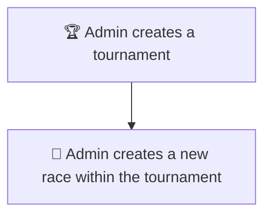

### Slide 7 — Registration
- ✅ **Owner** accepts the race invitation
- 🤝 **Owner** hires a jockey for the race

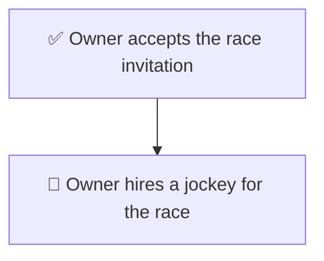

### Slide 8 — Confirmations
- ✅ **Jockey** accepts the invitation
- ✅ **Referee** accepts the invitation

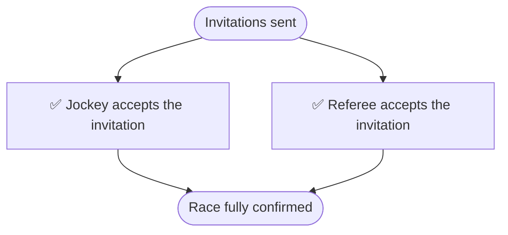

### Slide 9 — Pre-Race
- 🔮 **Spectator** submits a prediction
- 🔍 **Referee** verifies race participants

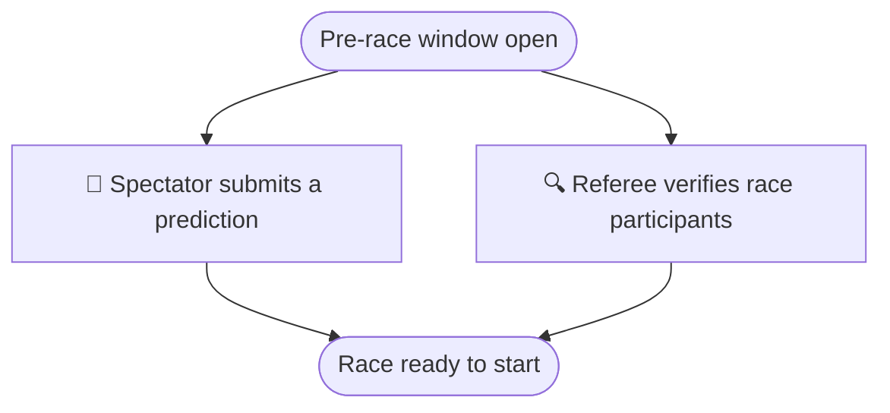

### Slide 10 — Race Execution
- 🚦 **Admin** starts the race
- ⚠️ **Referee** logs a violation mid-race
- ⚖️ **Referee** dismisses or verifies the violation

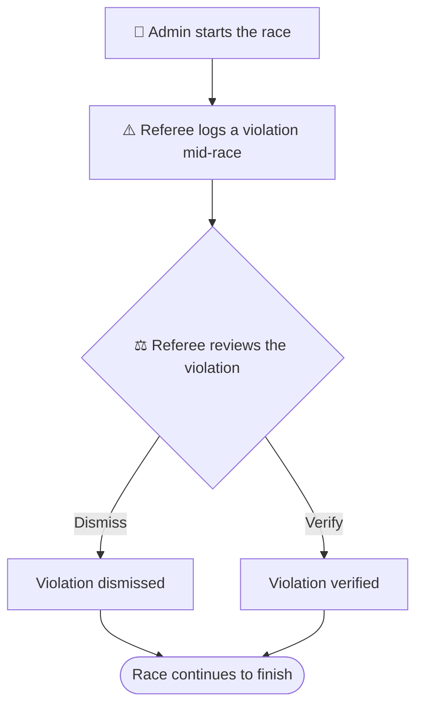

### Slide 11 — Result & Payout
- 🏁 **Referee** confirms the race result
- 💰 System processes payout to owners/jockeys/winning predictions

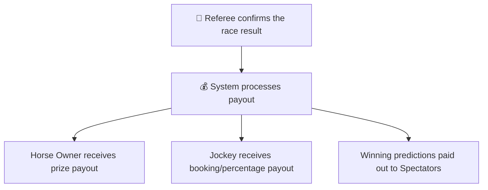

### Slides 6–11 — Combined Main Flow

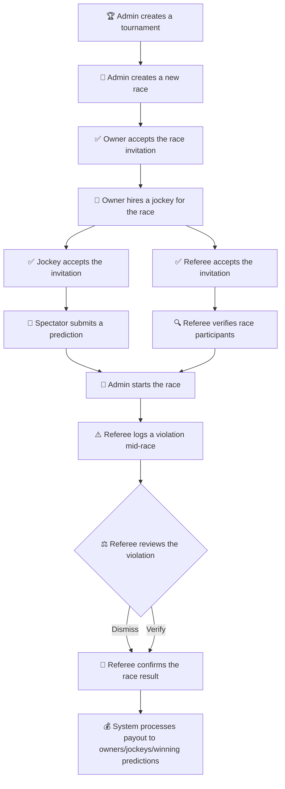

## Deep-Dive Flows — Race Round, Registration, Referee & Hiring a Jockey

*(Technical detail behind the Slide 6–11 beats — useful for Q&A or an appendix slide.)*

### Race Round Creation (Admin)

Admin submits the race round together with the lists of horse owners and referees to invite in one go; the system fans that out into pending Registration and RaceReferee records.

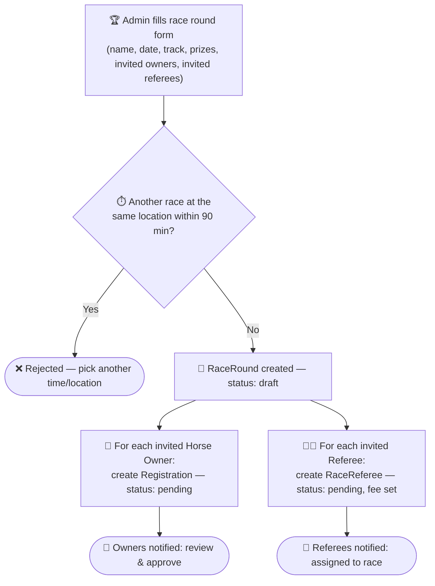

### Registration Lifecycle (Horse → Race Round)

Each invited horse owner's registration moves through approval, jockey hiring, and referee verification before the horse is race-ready.

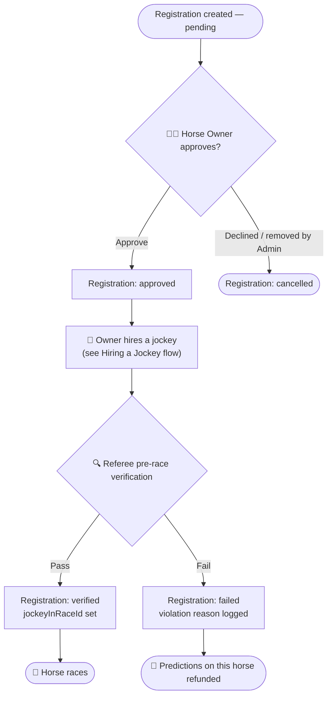

### RaceReferee Assignment & Payment

A referee's assignment carries its own accept/decline step and its own end-to-end payment confirmation, separate from prize payouts.

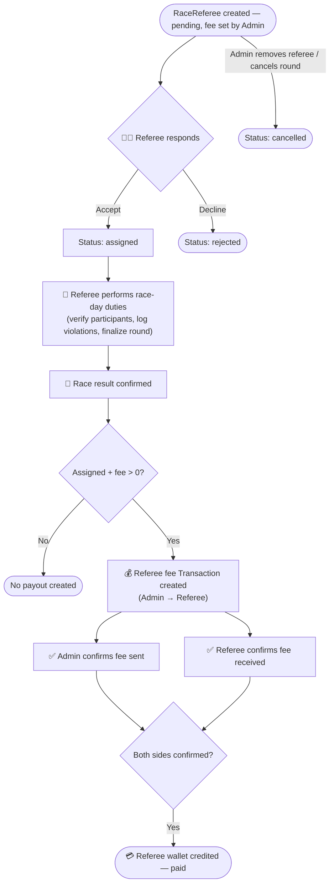

### Hiring a Jockey — Detailed

The Horse Owner picks the race, the horse, the jockey, the jockey's position (main vs. backup), and the payment terms — all in one invitation.

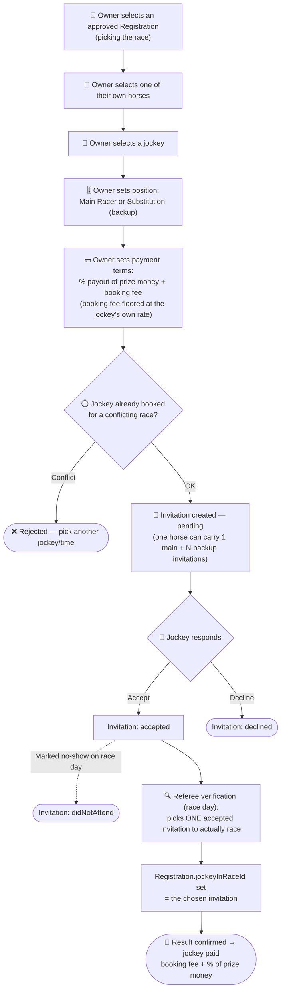

## Slide 12 (final) — Conclusion & Limitation

**Recap**
- Horsari digitizes and synchronizes the full race-management workflow across all 5 roles — Admin, Horse Owner, Jockey, Referee, Spectator
- Replaces manual coordination (spreadsheets, phone calls, paper results) with structured, auditable workflows: invitations, approvals, live tracking, payouts, predictions
- Real-time updates (Socket.io) keep every role in sync without manual refreshing, from race-round creation all the way to payout confirmation

**Limitations**
- Single-currency ledger — all transactions are converted to and settled in VND (`CurrencyConverter`); no true multi-currency wallets
- No offline mode — the mobile app (Jockey/Spectator) requires a live connection; no local queue-and-sync for spotty connectivity
- Manual, two-sided payout confirmation — Admin and payee each mark a transaction as sent/received by hand; there's no automated settlement or in-app dispute/appeal flow if one side disagrees
- No automated fraud or collusion detection — prediction and result data isn't screened for suspicious patterns (e.g. unusual betting concentration)
- A few workflow gaps surfaced during review: referees can act on race-day duties without their assignment being formally `accepted`, and the `laneNumber`/starting-position field exists in the data model but isn't yet wired into any UI flow
- Livestreaming depends on a third-party provider (Mux) — an external cost and availability dependency outside the team's control

**Future Work**
- Richer notification UI — grouping/read-state, and native push notifications on mobile instead of in-app only
- Analytics dashboard for Admins — tournament trends, referee/jockey performance history, payout summaries
- Automated fraud/anomaly detection for predictions and race results
- True multi-currency wallet and settlement support
- In-app dispute/appeal workflow for contested payments or race results
- Surface starting-position/lane assignment in the registration and race-day UI
- Offline-tolerant mobile experience with local action queueing and background sync
